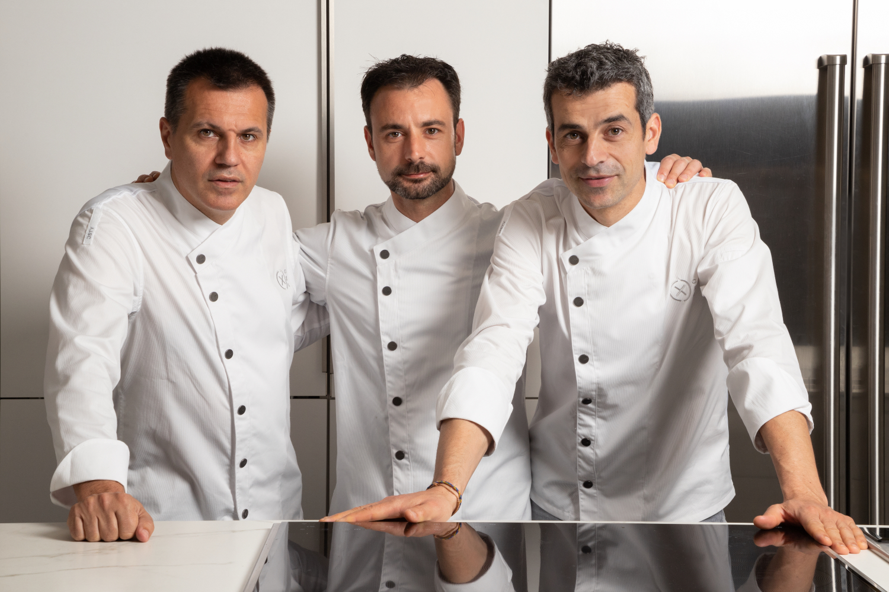

# Restaurant Disfrutar - Barcelona

## Descripció general

El **Restaurant Disfrutar** és un dels restaurants gastronòmics més reconeguts de **Barcelona**, fundat pels ex-xefs d’**El Bulli**.

## Experiència gastronòmica

- Menú degustació amb més de *25 plats* innovadors.  
- Cuina d’autor amb tècniques modernes.  
- Ambient elegant i acollidor.  
- Ideal per **celebracions especials** o **experiències gourmet**.

## Enllaç oficial
[Pàgina web de Disfrutar](https://www.disfrutarbarcelona.com)

## Imatge del restaurant

## Taula resum

| **Aspecte**        | **Detall**                        |
|--------------------|-----------------------------------|
| Tipus de cuina     | Creativa / Mediterrània moderna   |
| Localització       | Carrer Villarroel, 163 - Barcelona |

## Dades curioses
- **3 estrelles Michelin**.  
-  dels **millors restaurants del món** segons *The World’s 50 Best Restaurants*.  
- Els xefs Oriol Castro, Eduard Xatruch i Mateu Casañas van treballar junts a *El Bulli*.

